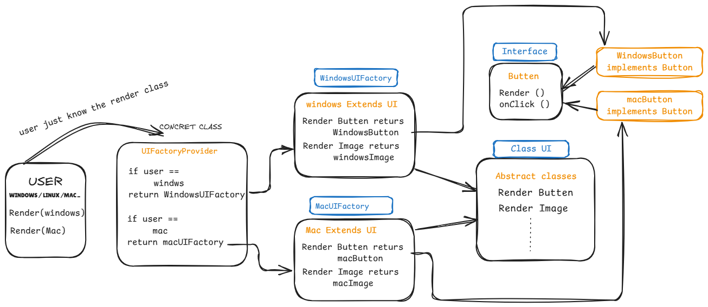

## Factory Method Design Pattern

Abstract factory design pattern hides the complex implementations, providing a class that can return required implementations. It is not just useful for end users, also makes developers' lives easier by having the structured code implementations. 

Let's first understand the terms we are going to use

### Factory
- It is a Suppurate Entity that has its own set of functionalities, Principles and use cases. It is considered to have different implementations for different factories. A factory code is always Abstracted from the client and made easy by defining abstract functions in an Abstract Interface. 

### Concrete class
- The entry of the design structure returns the factory methods according to the end user's needs. Hides all the complexity. In here, we define a set of rules so that the user gets the desired output without any higher Archie understanding of the entire code structure.

**Example** - Imagine the concept class like a waiter in a hotel. Waiter serves food by taking orders without involving you in the complexity of searching for it.

### Abstract Factory  
- It has all the abstract methods (a function without a body) that every factory class must override. It gives commonality between factory classes so that if any other factory classes are created in the future, there is a way to match the functionalities.

**Example** - We can consider it like the chef's rooms. One chef room prepares cheese products, and another prepares chickens. There might be different sections for different kinds of food items, but in the end, they must return the food that a waiter can serve. If it is a burger, a waiter might have different arrangements, no matter the kind of burger, the same case for pizza. Preparing food is a common functionality over here. 

Abstract factory defines set of functionalities ( preparing food ) that every factory class ( Chef sections ) must do , programmatically it is done by extending the class and overriding the abstract methods.


### Factory class 
- There can be different factory classes, each of which has its own way of implementing Abstract factory methods. Every factory class returns the set of product classes.

**Example** - Let's say the hotel has different sections for different types of burgers or pizzas ( Cheese Burger, Chicken Burger, etc.). We can consider the place where cheese products are prepared as a different section (cheese Factory class) and chicken products ( chicken Factory class). At the end, every section must return a burger with two pieces of bread. This is what the factory class defines. There can be different implementations, but they return the same thing that the abstract factory expects. The abstract factory expects Abstract product classes.


### Abstract Products 
- This is the interface that defines the structure of the product class. Every product class must implement the abstract product interfaces and define the functions defined in it.

**Example** Let's say it may be a burger or a chicken burger; they implement the same burger structure. Same case for pizza, whether it is a cheese one or a chicken one, they must implement the pizza structure.

### Product classes : 
- This is where actual logic is present. It is like abstract product interfaces define the structure, and product classes actually implement that.


### All Together
If we all go together from the customer to the chef. First, the customer orders the food to the waiter( client calling the concrete class), the waiter decides to route the order to cheese or chicken factories ( concrete class has a set of rules that is where request routing to the appropriate factory class is defined). As the request reaches the cheese factory or chicken factory, it is then decided what to make: a burger or pizzas. If it is a burger, then burger structure needs to be implemented, or if it is pizza, pizza structure needs to be implemented. So every factory returns products, which must be implemented using the product interfaces. One important thing is that where it is a cheese factory or a chicken factory they must have burger and pizza if not the request is denied by the waiter ( every factory class must have the methods defined in the abstract class, also the products returned by the factory class methods must implement the abstract product interfaces so that there can be commonality between different factory classes, every method in the factory class returns a product class that product class implement the abstract product interface). To be clearer, each product class has an abstract product interface. In the case of our example, pizza and burger are the product classes, and the factory decides whether to make cheese or chicken. So the factory decides the logic and product classes must implement Abstract product interfaces.

Client → Concrete Factory (Waiter) → Factory Class (Chef Section) → Abstract Product (Food Structure) → Product (Actual Dish)
### Let's have a small real-time case to understand the **Factory Method Design Pattern**

Let's say we have two Different OS, **Mac** and **Windows**, they decided to show the UI on the screen to the users. Obviously, Windows has its own way of presenting Images and buttons, and Mac has its own way. To have synchronisation, Implementation needs to be the same. Such that if a person has to see a webpage, they do not need to interact in different ways in different operating systems, right? To maintain this, we are now going to look at how the Factory method design pattern solves this problem.



### Concrete Class (ConcretClass.go)

Let's consider main.go has a Client, FMDP concept is very simple, it just exposes the concert class, which returns the actual class according to the user requirements. This ConcretClass, in our case, is responsible for checking what particular OS the Client is using and based on that, it returns us a factory.

### Abstract Factory ( interfaces/FactoryInterface.go)

Abstract Factory lets the client understand what Functions we can perform using the Factory Class returned by the Concrete Class. It contains the set of predefined abstract functions that must be performed by the Factory Class. In our case, our theme is all about rendering ui, and functions are RenderImage and RenderBatten. There can be more, but for simplicity, I have defined these two. Tomorrow, a new factory comes like Ubuntu or any other; they must look at the abstract Factory interface and implement those functions. Here, the work of developers became simple and also the Clients.

### Factory Class (windows/WindowsFactory.go, mac/MacFactory.go)

Factory Classes are the place where all the functions that are defined in the Abstract Factory are implemented. In our case, we have two factories, Windows and Mac. In GoLang, we can use a struct as a class. So now we have the WindowsFactory struct and the MacFactory struct. Both of these have RenderImage and RenderBatten functions.

### Product Interfaces (interfaces/ProductInterfaces.go)

As we just discussed, whether it is Windows or Mac, a button must be clicked and an image must be viewed. So, Product interfaces define that structure. For simplicity, we just made the output as a string, but in real scenarios, there can be something like onClick, hover, colour, height, width, etc, and the images interface is different from the batten interface. The product interface gives a set of functions that need to be implemented by products(Battens, Images, etc..)   

### Concrete Factory Products

If you look at the Return types of the abstract functions defined in the Factory Class, these are factory product interfaces which is actually implemented by product classes. Everything Function that is defined under Product Interface must be implemented by Factory Products. In the case of Windows, we have WindowsImage and WindowsBatten return product interfaces like Images and Battens. 

```go
func main() {
  WindowsUI := UIrendering("windows")
  MacUI := UIrendering("Mac")
  fmt.Println(WindowsUI.RenderImage().Render())
  fmt.Println(WindowsUI.RenderBatten().Render())
  fmt.Println(MacUI.RenderImage().Render())
  fmt.Println(MacUI.RenderBatten().Render())
}
```
The flow is like UIrendering is a concrete class that returns a Factory interface (return Type ui), this UI has a set of Functions like RenderImage and RenderBatten. Render gives factory-specific implications.  


